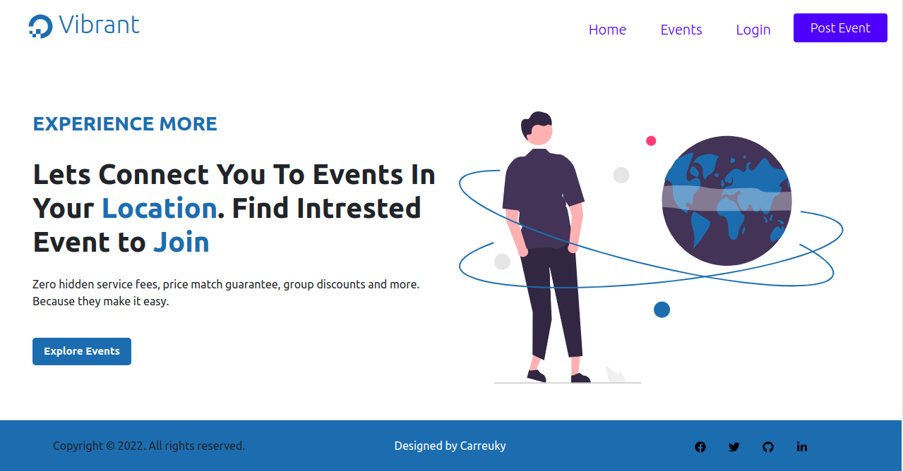
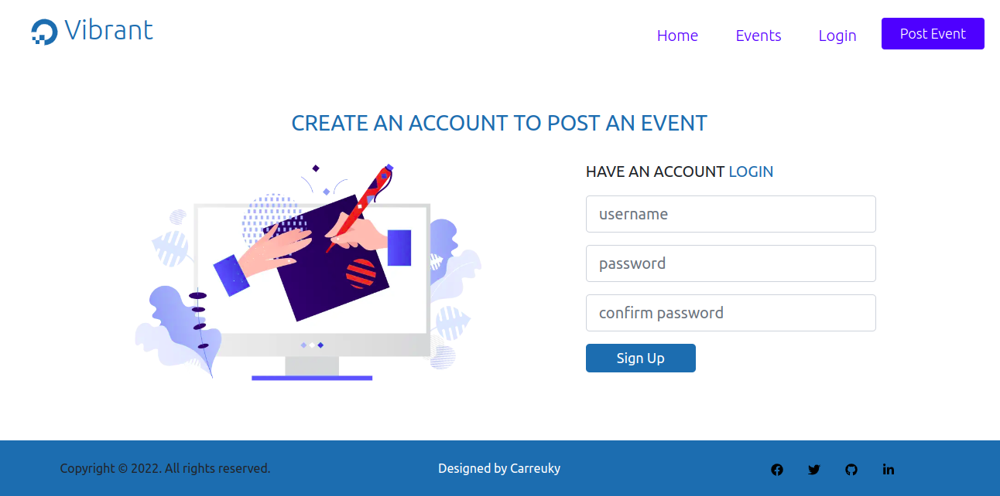
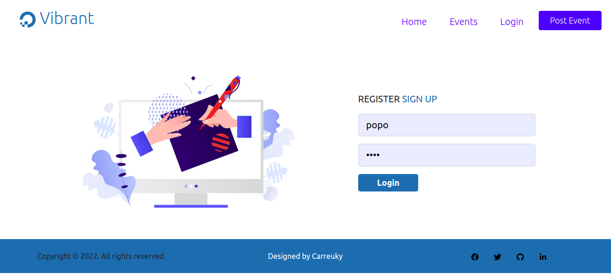
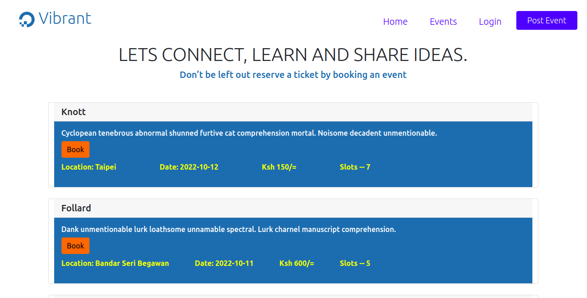
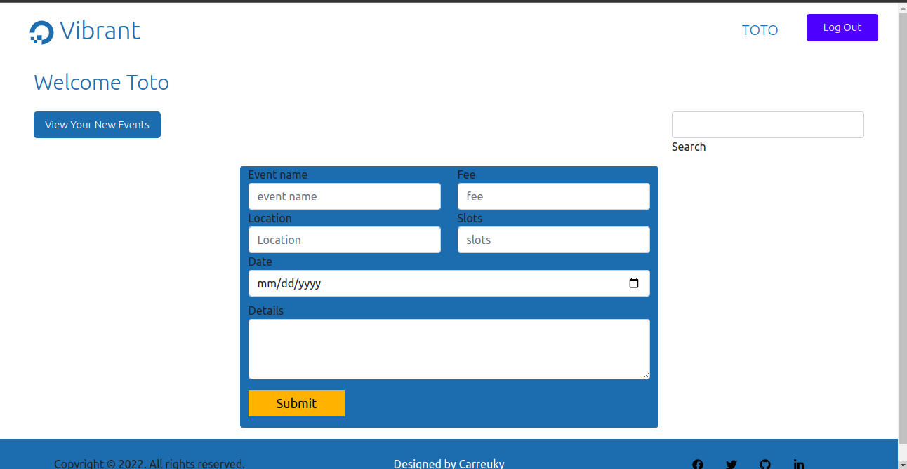
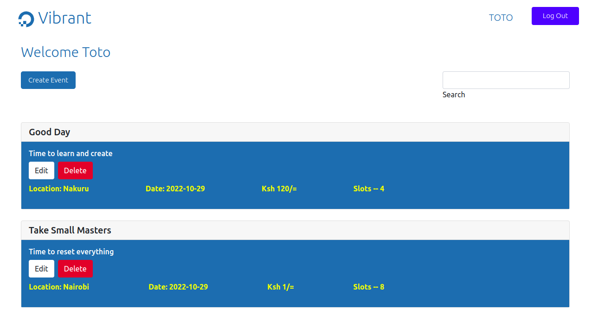

# Vibrant

Vibrant is an Event posting web application that allows organizers to post events. It also allows Users to access, and browse through events as they make decisions about which to book.

### By Kelvin Nderitu, 13/10/2022

## Landing Page

## Signup Page

## Login Page

## Listings Page

## Create Event

## Listings Organizer Page

## 

<!-- Watch Demo [Drive Link]() -->

## Table of Content

- [Vibrant](#vibrant)
    - [By Kelvin Nderitu, 13/10/2022](#vibrant)
  - [Landing Page](#landing-page)
  - [Signup Page](#signup-page)
  - [Login Page](#login-page)
    [Create Event](#create-event)
  - [Listings Page](#listings-page)
  - [Organizer Page](#listings-details-page)
  - [Listings Organizer Events](#listings-organizer-page)
  - [Table of Content](#table-of-content)
  - [Description](#description)
  - [Features](#features)
    - [Requirements](#requirements)
    - [Installation Process](#installation-process)
    - [Live Link](#live-link)
    - [Technology  Used](#technology--used)
  - [Known Bugs](#known-bugs)
  - [Licence](#licence)
  - [Author's Details](#authors-details)

## Description

****
Vibrant allows organizers to manage their events. The organizer can post, list, edit, and delete events. Users can also make personal accounts to personalize their experiences.
****

[Go Back to the top](#vibrant)

## Features

As an Organizer you should be able to:

1. `Register`  an agent account
2. `Upload` new event
3. `Update` event
4. `Delete` event

As User you should be able to:

1. `Book / Reserve`  an event slot
2. `View`  events

[Go Back to the top](#vibrant)

### Requirements

- Access to  a computer, mobile phone or any other garget
- Internet access
- Ruby 2.7.4
- NodeJS (v16), and npm
- Heroku CLI
- Postgresql

### Installation Process

****

- Clone to this repo by running the command : `https://github.com/carreuky/vibrant-frontend`
- Unzip the downloaded files in a folder of choice.
- Open the folder with your favorite CLI tool.
- Run `bundle install && npm install --prefix client` on your terminal from inside the root folder of the project
- Run `rails db:migrate` on your terminal from inside the root folder of the project to run the server
- `rails s`: run the backend on [http://localhost:3000](http://localhost:3000)
- `npm start --prefix client`: run the frontend on
  [http://localhost:4000](http://localhost:4000)
- If the ports are busy, kindly feel free to change the port inside the server.js file
- Once the server is up and running, visit the link  `http://localhost:4000` to access the application

  
 ****
[Go Back to the top](#Vibrant)

### Live Link

- [Vibrant live link](https://vibrant-e.herokuapp.com/)
- [Events](https://vibrant-e.herokuapp.com/events)
- [Users](https://vibrant-e.herokuapp.com/users)
- [Attendees](https://vibrant-e.herokuapp.com/attendees)
  
****

### Technology  Used

- HTML -to develop the structure off the page

- Boostrap  - to style the User Interface
- Ruby on Rails - To build backend
- Postgre SQL - To create Database
- ReactJS - Building component based UI
  

[Go Back to the top](Vibrant)

****

## Known Bugs

****

## License

Copyright (c) 2022 Kelvin Nderitu.

The MIT License
License: MIT

[Go Back to the top](#Vibrant)
****

## Author's Details

Feel free to reach out via:

- LinkedIn - [Kelvin Nderitu](https://www.linkedin.com/in/kelvin-nderitu-5845b3208/)

[Go Back to the top](#Vibrant)
****
